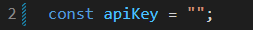
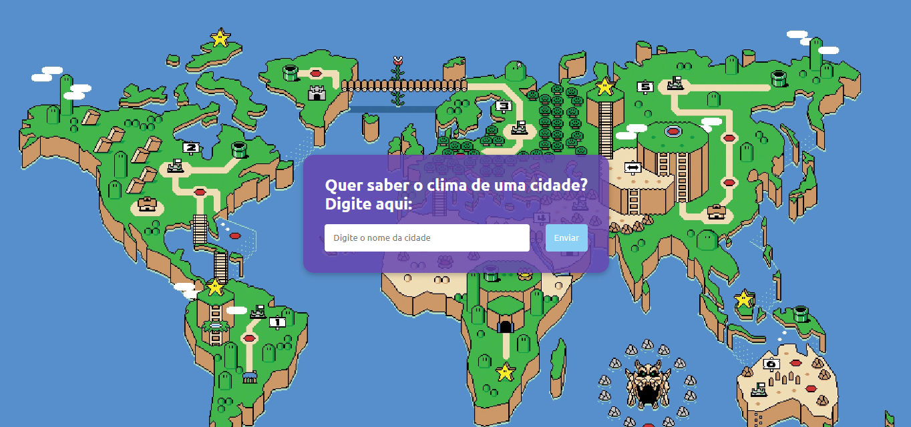
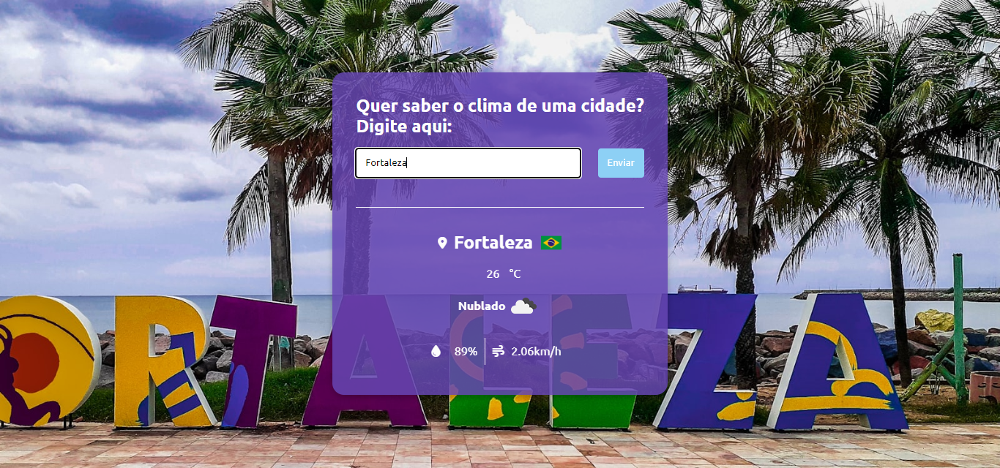

# Projeto de informações sobre clima de cidades

Este projeto é uma aplicação web desenvolvida com HTML, CSS e JavaScript que permite aos usuários pesquisar o clima de uma cidade específica. O projeto utiliza a API Current Weather Data da [OpenWeather](https://openweathermap.org/) para fornecer informações atualizadas sobre o clima de qualquer lugar do mundo, utiliza a API [FlagsAPI](https://flagsapi.com/) para os símbolos de bandeira dos países e utiliza a API [Unsplash](https://unsplash.com/pt-br) para gerar imagens personalizadas de background de acordo com a cidade que o usuário digitou.

## Funcionalidades

- **Pesquisa de Cidade:** Os usuários podem inserir o nome de uma cidade no campo de pesquisa e obter informações detalhadas sobre o clima naquela área.
- **Exibição de Informações:** Após a pesquisa, o site exibe dados como temperatura atual, condições climáticas, umidade e velocidade do vento para a cidade pesquisada.
- **Imagens dinâmicas:** O projeto foi desenvolvido para ter imagens dinâmicas, ao digitar uma determinada cidade, a página retorna um background relacionado a cidade e foto da bandeira do determinado país a qual a cidade pertence.

## Como Rodar o Projeto

Para rodar este projeto localmente, siga estas etapas:

1. **Clone o Repositório:** Clone este repositório para sua máquina local utilizando o seguinte comando no terminal:

   

    git clone https://github.com/arthurgab03/projeto-clima.git
   

2. **Cadastre-se na OpenWeather:** Antes de executar o projeto, você precisará se cadastrar na OpenWeather para obter um token de API. Acesse [OpenWeather](https://openweathermap.org/) e siga as instruções para se cadastrar e obter seu token.

3. **Insira o Token da OpenWeather:** Após obter o token da OpenWeather, insira-o no código-fonte do projeto. Você precisa colocar o token  entre as aspas duplas da linha 2 que fica localizada no arquivo script.js.

    

4. **Execute o Projeto:** Após inserir seu token, abra o arquivo `index.html` em seu navegador da web preferido. Agora você pode pesquisar o clima de qualquer cidade e visualizar as informações detalhadas.

    

 

    

